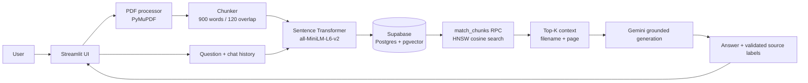

# Architecture

## Request flow

1. Streamlit accepts up to 50 PDFs per indexing action.
2. PyMuPDF extracts non-empty pages and preserves page numbers.
3. The chunker creates overlapping chunks with filename and page metadata.
4. The embedding model creates 384-dimensional normalized vectors in one batch.
5. Supabase stores documents and chunks and rejects duplicate file hashes.
6. Retrieval calls the `match_chunks` RPC so pgvector performs Top-K cosine search using the HNSW index.
7. Recent chat history and the retrieved chunks are sent to Gemini.
8. The response is constrained to source labels such as `[S1]`; the UI also displays the source filename and page.
